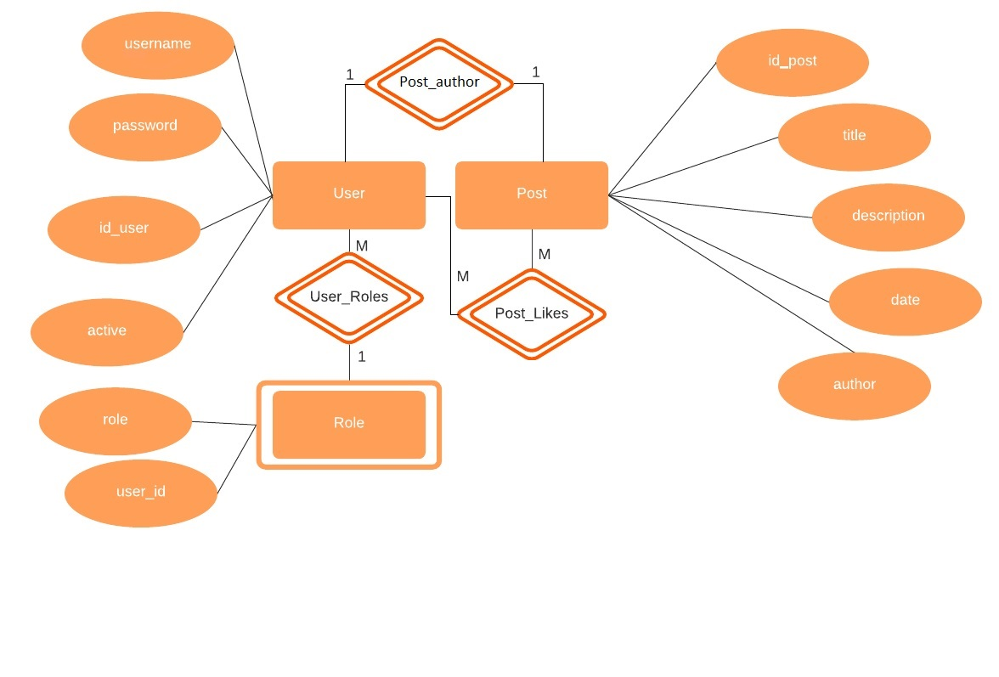
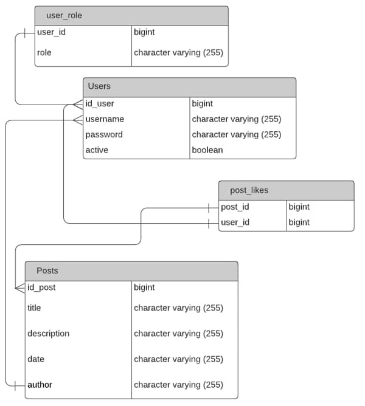

## Database design
## Описание сущностей и связей
<table>
  <tr>
    <th>Сущность</th>
    <th>Свойство</th>
    <th>Комментарий</th>
  </tr>
  <tr>
    <th rowspan="5">Пост</th>
    <th>id_post</th>
    <th>Идентификационный номер поста</th>
  </tr>
  <tr>
    <th>title</th>
    <th>Заголовок поста</th>
  </tr>
  <tr>
    <th>description</th>
    <th>Текст поста или его полное описание</th>
  </tr>
  <tr>
    <th>date</th>
    <th>Дата создания поста</th>
  </tr>
  <tr>
    <th>author</th>
    <th>Имя пользователя, опубликовавшего пост</th>
  </tr>
  <tr>
    <th rowspan="4">Пользователь</th>
    <th>id_user</th>
    <th>Идентификационный номер пользователя</th>
  </tr>
  <tr>
    <th>active</th>
    <th>Текущие состаяние аккаунта (действителен аккаунт или нет)</th>
  </tr>
  <tr>
    <th>username</th>
    <th>Имя пользователя, которое используется для входа в систему и которое будет отображать под постом в качестве автора</th>
  </tr>
  <tr>
    <th>password</th>
    <th>Пароль для входа в систему по данным username</th>
  </tr>
  <tr>
    <th rowspan="2">Лайк</th>
    <th>post_id</th>
    <th>Идентификационный номер лайкнутого поста</th>
  </tr>
  <tr>
    <th>user_id</th>
    <th>Идентификационный номер пользователя, лайкнувшего пост</th>
  </tr>
  <tr>
    <th rowspan="2">Роль</th>
    <th>role</th>
    <th>Название роли</th>
  </tr>
  <tr>
    <th>user_id</th>
    <th>Идентификационный номер пользователя, которуму полагаются права данной роли</th>
  </tr>
</table>

<table>
     <tr>
          <th>Название связи</th>
          <th>Что связывает</th>
          <th>Описание</th>
     </tr>
     <tr>
          <th>Связь между постом и лайкнувшеми его людьм (Post_Likes)</th>
          <th>Связывает идентификационный номер поста с индентификационными номерами людей, лайкнувших данный пост</th>
          <th>Для этой связи специально была создана отдельная сущность "Лайк". В ней отражается, какой конктретно пост, каким контретно человеком был лайкнут. Пост могут лайкнуть несколько человек. Один и тот же человек может лайкнуть несколько постов.</th>
     </tr>
     <tr>
          <th>Принадлежность роли определенному пользователю (User_Role)</th>
          <th>Кокретные роли с конкретным идентификационным номером пользователя</th>
          <th>Для этой связи специально была создана отдельная сущность "Роль". В ней отражается
            у каких пользователей имеется какая-либо роль. На одну роль может быть несколько пользователей.</th>
     </tr>
</table>

## ER диаграмма

## Даталогическая модель

