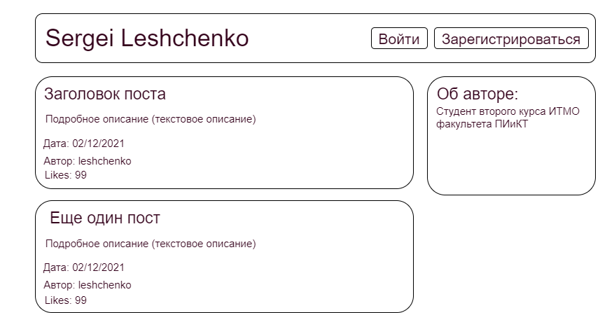
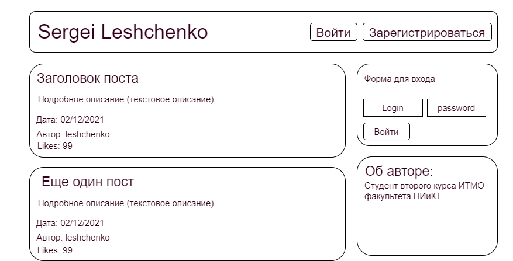
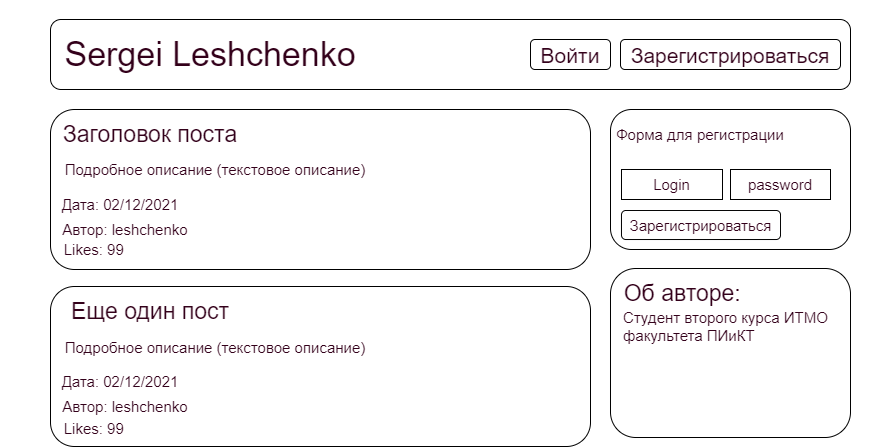
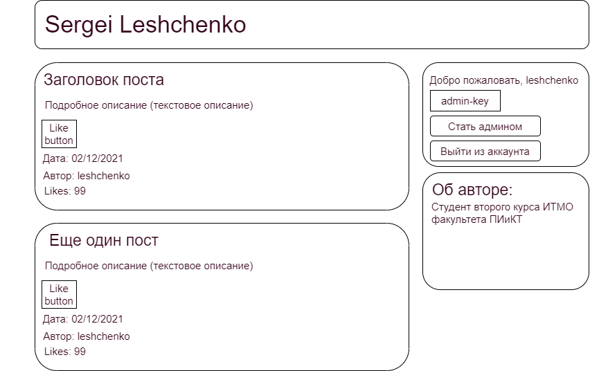
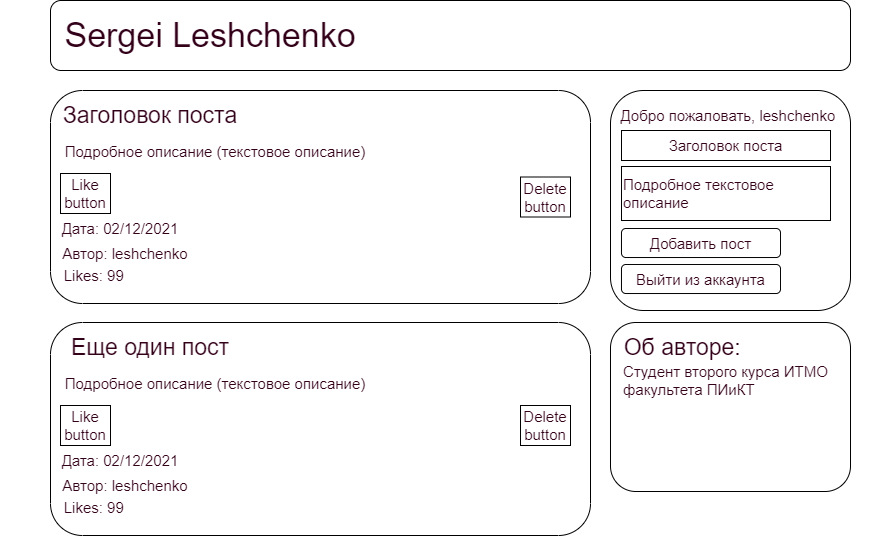
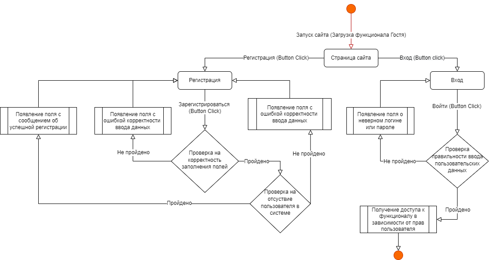
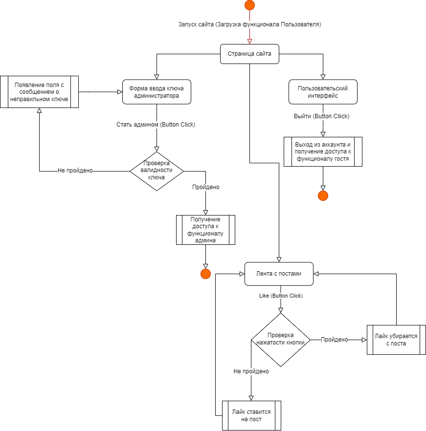
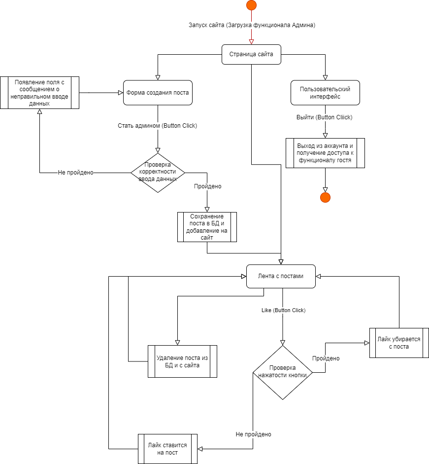

## Проектирование интерфейсов
## Список интерфейсов
Ниже представлен список интерфейсов, которые доступны пользователю в зависимости от его роли на сайте.
### Случайный посетитель сайта (Гость)
<ul>
    <li>Шапка сайта с кнопками "Вход" и "Регистрация"</li>
    <li>Форма для входа</li>
    <li>Форма для регистрации</li>
    <li>Лента с постами</li>
    <li>Окно с информацией об владельце сайта</li>
</ul>

### Залогиненный пользователь без прав администратора (User)
<ul>
    <li>Шапка сайта без кнопок "Вход" и "Регистрация"</li>
    <li>Область с информацией о залогиненном пользователе и кнопкой выхода из аккаунта</li>
    <li>Форма ввода ключа админа</li>
    <li>Лента с постами, на которых есть кнопка лайка</li>
</ul>

### Залогиненный пользователь с правами администратора (Admin)
<ul>
    <li>Шапка сайта без кнопок "Вход" и "Регистрация"</li>
    <li>Область с информацией о залогиненном пользователе и кнопкой выхода из аккаунта</li>
    <li>Форма для публикация поста</li>
    <li>Лента с постами, на которых есть кнопка лайка и кнопка удаления поста</li>
</ul>

## Экскизы интерфейсов
### Для случайного посетителя (Гостя)
<li>Основная страница</li>

<li>Вход (кликнута кнопка "Войти" из шапки)</li>

<li>Регистрация (кликнута кнопка "Зарегистрироваться" из шапки)</li>

### Для залогиненного пользователя (User)

### Для залогиненного пользователя с правами админа (Admin)

## Диаграммы функциональности интерфейсов
### Для случайного посетителя (Гостя)

### Для залогиненного пользователя (User)

### Для залогиненного пользователя с правами админа (Admin)

