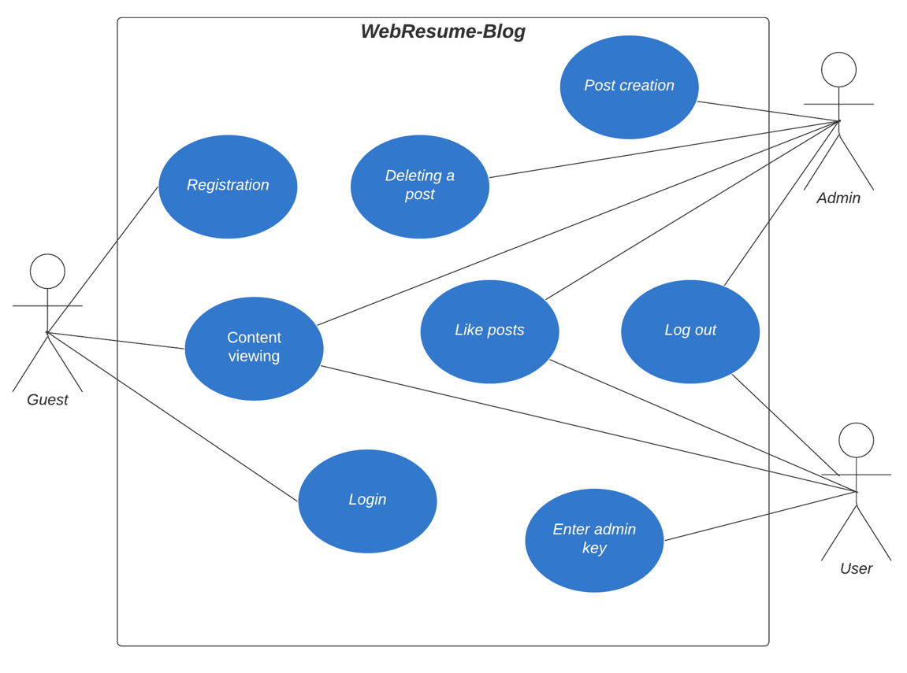

## Designing Use Cases
### 1) List of actors 
This application has 3 actors: admin, user and guest.
Admin can:
1) Add posts
2) Delete posts
3) Like posts or remove likes from posts 

The user can likes posts and removes likes from posts. And the guest can only look at the content without changing it in any way.
### 2) Use Case Diagram

### 3) Use case specifications

<table>
  <tr>
    <th>Use case</th>
    <td>Registration</td>
  </tr>
  <tr>
    <th>Short description</th>
    <td>This use case allows guests to register an account in the system.</td>
  </tr>
  <tr>
    <th>Actors</th>
    <td>Guest</td>
  </tr>
  <tr>
    <th>Preconditions</th>
    <td>The guest knows what his username and password will be.</td>
  </tr>
  <tr>
    <th>Main stream</th>
    <td>The guest enter a username and password in the form, then clicks on the "register" button.</td>
  </tr>
  <tr>
    <th>Alternate streams</th>
    <td>If there is an account with the same username, the guest receives a message about it. Registration can be repeated again in the same window.</td>
  </tr>
  <tr>
    <th>Postconditions</th>
    <td>After successful registration will be written in the current window "Success". Otherwise, there will be no changes.</td>
  </tr>
</table>

<table>
  <tr>
    <th>Use case</th>
    <td>Login</td>
  </tr>
  <tr>
    <th>Short description</th>
    <td>This use case allows guests to login with their account in the system.</td>
  </tr>
  <tr>
    <th>Actors</th>
    <td>Guest</td>
  </tr>
  <tr>
    <th>Preconditions</th>
    <td>The guest knows what his username and password is.</td>
  </tr>
  <tr>
    <th>Main stream</th>
    <td>The guest enter a username and password in the form, then clicks on the "login" button.</td>
  </tr>
  <tr>
    <th>Alternate streams</th>
    <td>If the guest entered an incorrect username or password, information about this appears in the current window, the guest can repeat the second attempt to enter in the same window.</td>
    
  </tr>
  <tr>
    <th>Postconditions</th>
    <td>After a successful login, the guest turns into an admin or user. Otherwise, nothing changes.</td>
  </tr>
</table>

<table>
  <tr>
    <th>Use case</th>
    <td>Logout</td>
  </tr>
  <tr>
    <th>Short description</th>
    <td>This use case allows users or admins logout from the system and become guest.</td>
  </tr>
  <tr>
    <th>Actors</th>
    <td>Admin, User</td>
  </tr>
  <tr>
    <th>Preconditions</th>
    <td>Only have the appropriate role.</td>
  </tr>
  <tr>
    <th>Main stream</th>
    <td>Actor clicks on the logout button.</td>
  </tr>
  <tr>
    <th>Alternate streams</th>
    <td>Absent</td>
  </tr>
  <tr>
    <th>Postconditions</th>
    <td>After clicking on the logout button, the actor is taken to the home page as a guest</td>
  </tr>
</table>

<table>
  <tr>
    <th>Use case</th>
    <td>Post creation</td>
  </tr>
  <tr>
    <th>Short description</th>
    <td>This use case allows admins create a posts with adding this in blog.</td>
  </tr>
  <tr>
    <th>Actors</th>
    <td>Admin</td>
  </tr>
  <tr>
    <th>Preconditions</th>
    <td>The admin knows what the post title and description will be.</td>
  </tr>
  <tr>
    <th>Main stream</th>
    <td>The admin enters a title and description into the form, and then clicks on the "create new post" button.</td>
  </tr>
  <tr>
    <th>Alternate streams</th>
    <td>If the admin tries to send a post with an empty title, an error is thrown.</td>
  </tr>
  <tr>
    <th>Postconditions</th>
    <td>After successful creation, the post appears on the page without refreshing the page, it will also have the creation date, author's username and the number of likes.</td>
  </tr>
</table>

<table>
  <tr>
    <th>Use case</th>
    <td>Deleting a post</td>
  </tr>
  <tr>
    <th>Short description</th>
    <td>This use case allows admins to delete a posts.</td>
  </tr>
  <tr>
    <th>Actors</th>
    <td>Admin</td>
  </tr>
  <tr>
    <th>Preconditions</th>
    <td>The admin knows what the post or posts he wants to delete.</td>
  </tr>
  <tr>
    <th>Main stream</th>
    <td>The post on the left has a button with a trash bucket image, the admin clicks on it.</td>
  </tr>
  <tr>
    <th>Alternate streams</th>
    <td>Absent</td>
  </tr>
  <tr>
    <th>Postconditions</th>
    <td>After clicking on the delete button, the post is deleted and disappears without refreshing the page. Otherwise, nothing happens.</td>
  </tr>
</table>

<table>
  <tr>
    <th>Use case</th>
    <td>Like posts</td>
  </tr>
  <tr>
    <th>Short description</th>
    <td>This case allows actors to put likes on posts or remove them if they have already been settled.</td>
  </tr>
  <tr>
    <th>Actors</th>
    <td>Admin, User</td>
  </tr>
  <tr>
    <th>Preconditions</th>
    <td>The actor knows on which post he wants to put or remove the like.</td>
  </tr>
  <tr>
    <th>Main stream</th>
    <td>The actor clicks on the button with the image of a heart on the post he needs.</td>
  </tr>
  <tr>
    <th>Alternate streams</th>
    <td>Absent</td>
  </tr>
  <tr>
    <th>Postconditions</th>
    <td>After clicking on the button, the heart on the button turns red, if the like did not stand before, if it was before, then the red color changes to transparent with a black border.</td>
  </tr>
</table>

<table>
  <tr>
    <th>Use case</th>
    <td>Entering admin key</td>
  </tr>
  <tr>
    <th>Short description</th>
    <td>This use case allows user enter a special key in the form to become an admin.</td>
  </tr>
  <tr>
    <th>Actors</th>
    <td>User</td>
  </tr>
  <tr>
    <th>Preconditions</th>
    <td>The user knows a special key</td>
  </tr>
  <tr>
    <th>Main stream</th>
    <td>The user enters the key into the form and clicks on the button.</td>
  </tr>
  <tr>
    <th>Alternate streams</th>
    <td>If the key is incorrect, then an error message will be displayed, the user can repeat the input in the same form.</td>
  </tr>
  <tr>
    <th>Postconditions</th>
    <td>If the key is successfully entered, a message appears stating that the user has become an administrator, now the administrator's roles are available to him. Otherwise, nothing changes.</td>
  </tr>
</table>